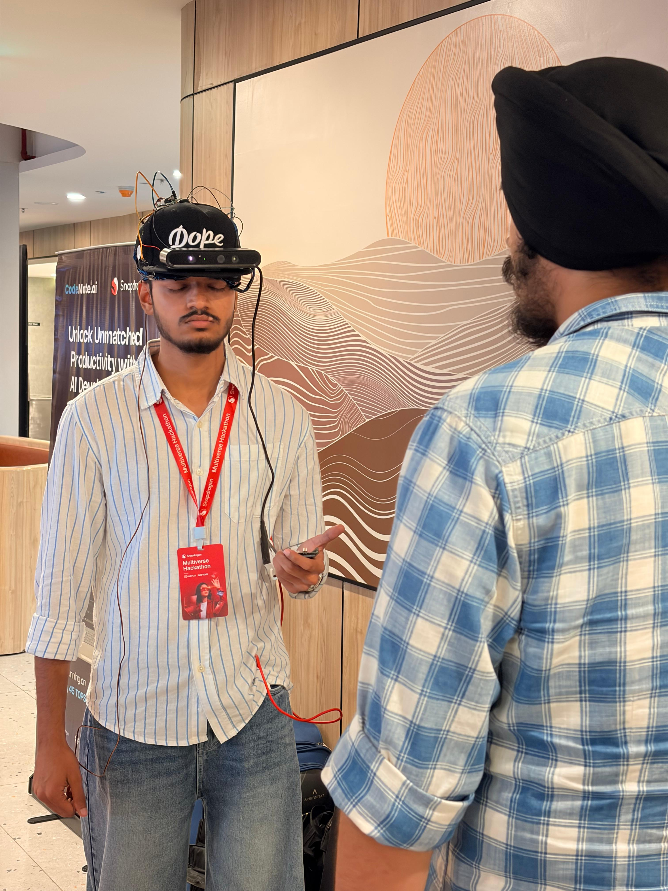
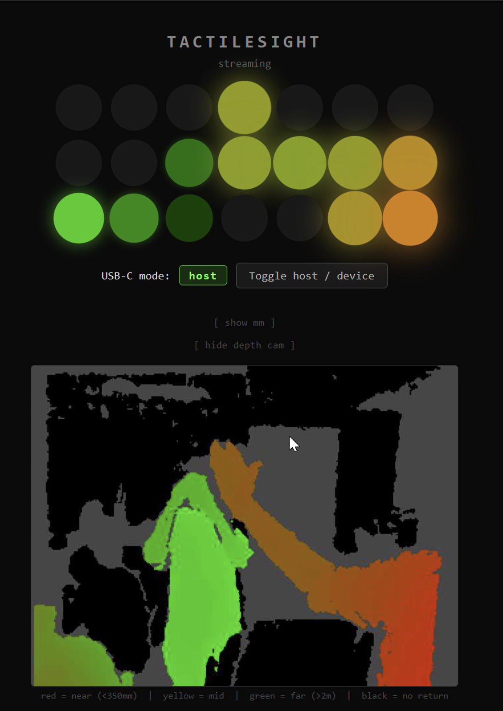
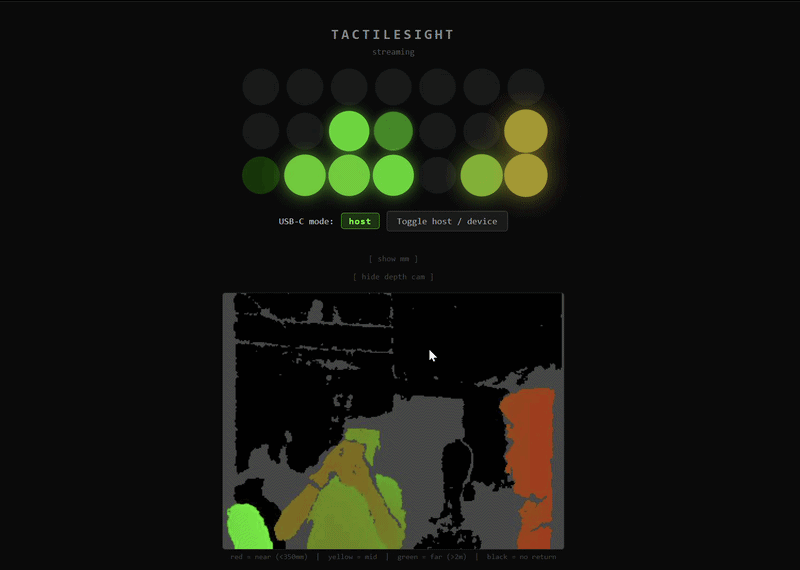
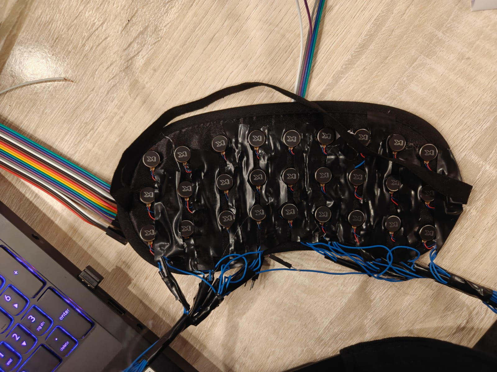
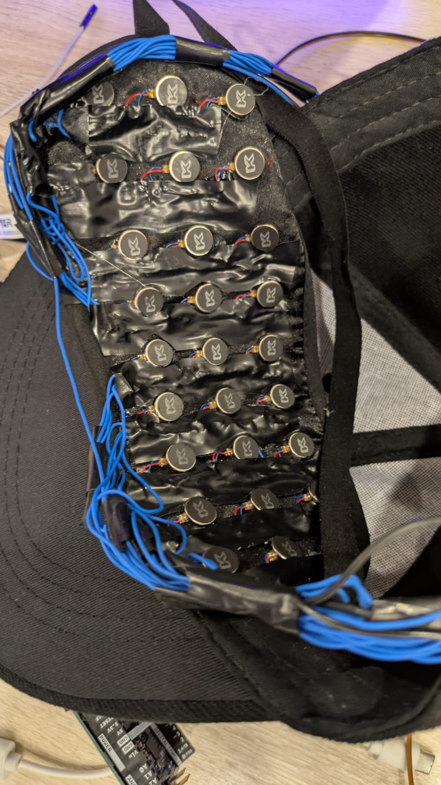
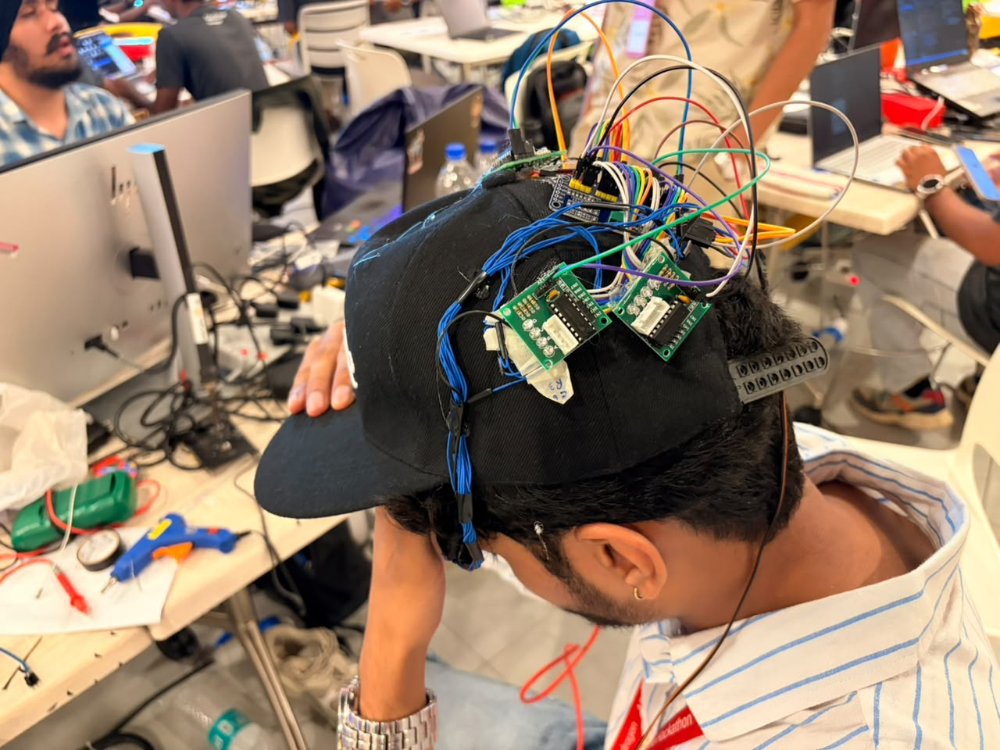
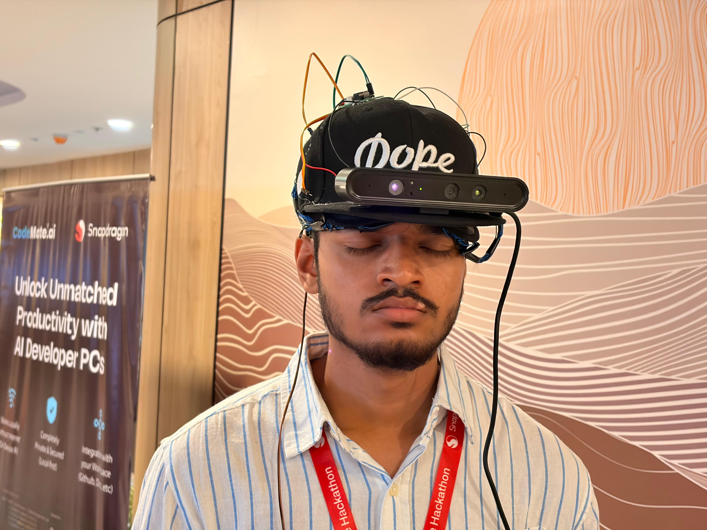
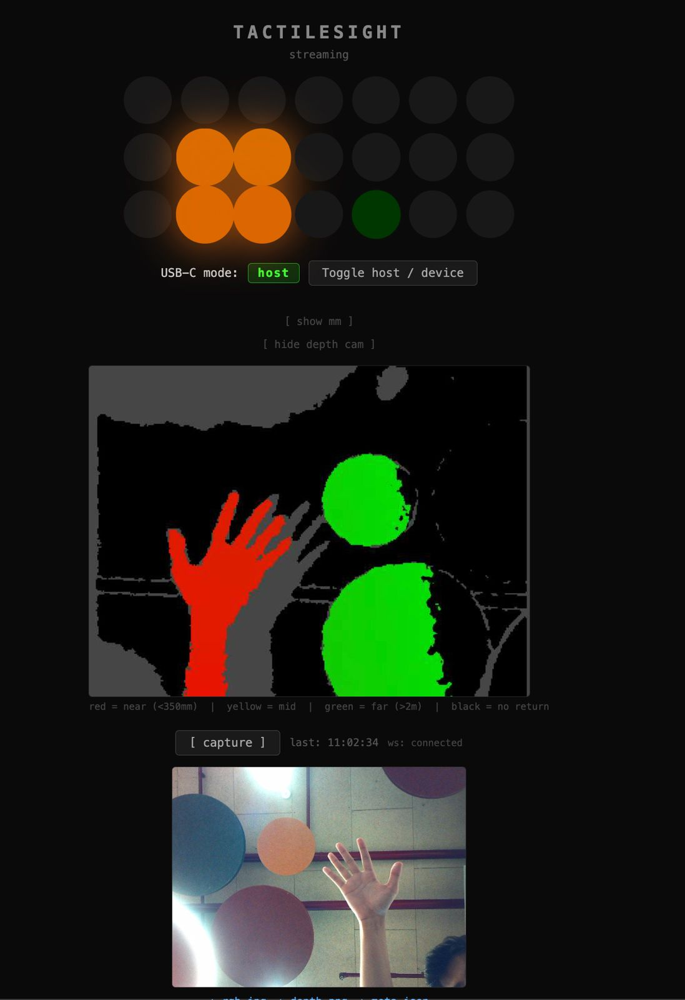
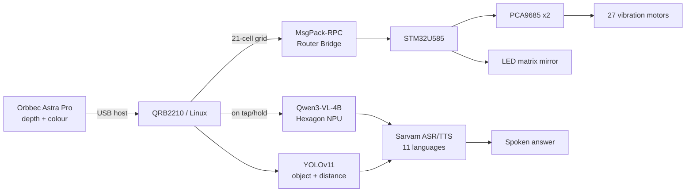

# TactileSight

**Beyond your eyes: a haptic headband that lets you feel the environment a cane can't reach.**

<table>
<tr>
<td width="50%"></td>
<td width="50%"></td>
</tr>
</table>

---

## See it in action

<p align="center"></p>

<p align="center"><sub>Live depth feed → 21-cell haptic grid → real-time motor output, all on one dashboard.</sub></p>

---

## The problem → The solution

A white cane reaches about a metre and tells you only that *something* is there, not that the doorway is on your left, or that the thing ahead is a person and not a pillar. 🦯 AI photo assistants can describe a scene, but they **guess** at distance from a flat image, and a confident wrong guess is worse than no answer at all when you're walking.

TactileSight splits the problem in two: a depth camera measures the world in millimetres, never guesses, and translates it straight into vibration on your skin. That is the reflex layer. A phone app adds the *what*, names, signs and spoken answers, on demand and in your own language. 🧭

---

## How it works

```
 Orbbec Astra Pro   ──depth──▶   21/27-cell grid   ──MsgPack-RPC──▶   STM32U585   ──I2C──▶   PCA9685 ×2   ──▶   27 motors
  depth camera         (QRB2210,      reduction         Arduino          (drives            (2 boards)      (buzz = near)
                        Hexagon NPU)                     Router Bridge)   the motors)
                            │
                            ▼
                    Qwen3-VL-4B + YOLOv11
                    (on-device, NPU)
                            │
                            ▼
                    Sarvam ASR / TTS
                    (11 Indian languages)
                            │
                            ▼
                     spoken answer
```

1. **Sense.** The Astra Pro captures colour + depth together, one frame at a time.
2. **Feel.** Depth is reduced to a haptic grid and pushed straight to vibration motors, no phone required.
3. **Understand.** On demand, a tap or hold on the phone runs the frame through an on-device vision model and YOLOv11 for what's ahead, and the depth sensor for how far.
4. **Speak.** The answer is translated and spoken back in the user's own language.

---

## Prototype gallery

<table>
<tr>
<td width="50%"><br/><sub>27-motor haptic pad, wired</sub></td>
<td width="50%"><br/><sub>Motor grid sewn into the headband</sub></td>
</tr>
<tr>
<td width="50%"><br/><sub>Soldering the motor wiring</sub></td>
<td width="50%"><br/><sub>Depth camera mounted, demo-ready</sub></td>
</tr>
<tr>
<td width="50%"><br/><sub>Live dashboard: depth feed + haptic grid</sub></td>
<td width="50%"></td>
</tr>
</table>

---

## Tech stack

`Arduino UNO Q (QRB2210 arm64 Linux)` &nbsp; `STM32U585 Cortex-M33` &nbsp; `Hexagon NPU / QAIRT` &nbsp; `Qwen3-VL-4B` &nbsp; `YOLOv11 (TFLite)` &nbsp; `Orbbec Astra Pro Plus` &nbsp; `Sarvam AI (ASR/TTS/Translate)` &nbsp; `Kotlin · CameraX (Android)` &nbsp; `Python (server)` &nbsp; `PCA9685 PWM drivers` &nbsp; `MsgPack-RPC / Arduino Router Bridge` &nbsp; `NFC`

---

## Key features

- Measures real obstacle distance from depth data. Never guesses, never invents a number
- Buzzes a 27-motor grid on the band in real time, no phone needed for the reflex layer
- One button on the phone: tap to describe what's ahead, hold to ask a question
- Reads signs and text aloud, so a corridor becomes navigable instead of just described
- Speaks and understands 11 Indian languages, confirmed back in the language just chosen

---

## Architecture



---

<details>
<summary><strong>Quick start</strong></summary>

**Phone app**

```bash
cd android
JAVA_HOME=/path/to/android-studio/jbr ./gradlew assembleDebug
```

Needs JDK 17 to 21, and a `sarvam.api.key` in `android/local.properties`. The QAIRT model bundle is pushed over `adb`, not bundled in the APK:

```bash
adb push <bundle>/. /sdcard/Android/data/com.tactilesight/files/models/geniex/
```

**Board / haptic server**

```bash
ssh arduino@<board-ip>            # password: vidhu123
sudo /usr/local/bin/usb-role host # camera needs host mode
systemctl status haptic-demo
# dashboard: http://<board-ip>:8081
```

First-time board setup: `linux/setup.sh`.

</details>

---

## Team

Built by the **TactileSight Team** for the Qualcomm Snapdragon Multiverse Hackathon, Noida, 18-19 July 2026.
