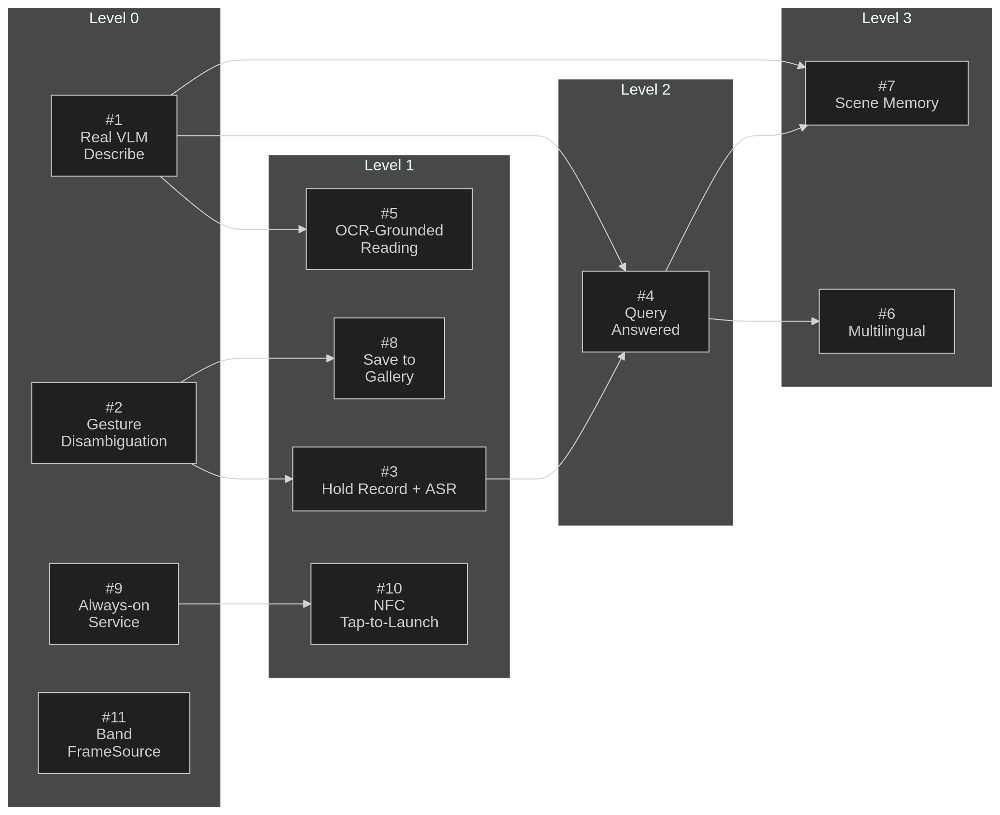
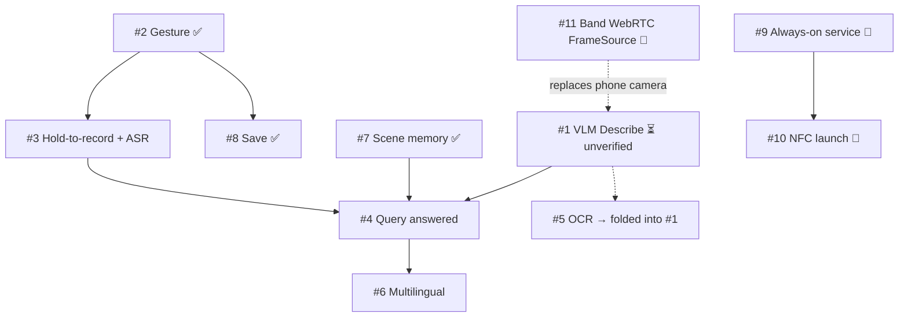

# TactileSight — Semantic Module (phone side)

On-device, on-demand **AI vision + multilingual voice** for blind & low-vision users, built for
the **Qualcomm Snapdragon Multiverse Hackathon** (Noida, July 18–19 2026).

A head-mounted **band** (RGB + depth cameras, Qualcomm UNO Q, on-band haptics) handles real-time
obstacle avoidance in hardware. **This repo is the phone half:** on a button press it answers
*"what's in front of me / what does that sign say / what's around me"* — richly, in the user's own
language, fused with the band's depth, **fully on-device (nothing leaves the phone).**

> 📄 Full design: [`docs/phone-module.md`](docs/phone-module.md) ([PDF](docs/phone-module.pdf)) ·
> Band contract: [`docs/band-interface.md`](docs/band-interface.md)

---

## The core loop (on-demand only)

```
Band button click ─(WebRTC)─▶ {1 JPEG + depth zones} ─▶ Phone
  single = Describe   hold = Query(voice)   double = Save
        │
        ▼
  Qwen3-VL-4B  (band depth injected into the prompt)   [+ IndicConformer ASR on Query]
        │
        ▼
  Spoken answer in the user's language (Android TTS) + logged to Scene Memory
```

**Two inference runtimes, on purpose:** **GenieX** (Qwen3-VL-4B, NPU) + **sherpa-onnx**
(AI4Bharat IndicConformer ASR) + Android TTS. Lean = it actually works on stage.

**Why we beat the benchmark (SixthSense, 2nd place at the ExecuTorch hackathon):** richer VLM
(4B vs their 0.5B) · **multilingual Indic voice they lack** · **depth×language fusion** they
can't do (*"a person is close on your left"*).

---

## Status

### ✅ Done (implemented + verified by unit tests)
| # | Feature | Evidence |
|---|---|---|
| [#2](../../issues/2) | One-button gesture disambiguation | `core/GestureRecognizer.kt` — pure state machine, **5 unit tests** |
| [#7](../../issues/7) | Scene memory (10-min rolling, cross-scene) | `core/SceneMemory.kt` — **4 unit tests**, wired into orchestrator |
| [#8](../../issues/8) | Save to gallery (double-press) | `impl/GallerySaver.kt` — MediaStore, wired + earcon |

### ⏳ Code-complete, NOT yet verified on-device (critical path)
| # | Feature | Note |
|---|---|---|
| [#1](../../issues/1) | Real VLM Describe | `impl/GenieXBrain.kt` written (Qwen3-VL-4B via GenieX, depth-in-prompt). **Real inference has never run — verifying it + measuring latency is the #1 task.** |

### 🔜 Remaining — core MVP
| # | Feature | Depends on |
|---|---|---|
| [#3](../../issues/3) | Hold-to-record + **IndicConformer ASR** (`transcribe()` is a stub today) | #2 |
| [#4](../../issues/4) | Query answered (VLM + spoken question) | #1, #3, #7 |
| [#6](../../issues/6) | Multilingual (user-setting; Hindi + English for demo) | #1, #3 |

### 🔧 Folded into the VLM (design pivot)
| # | Feature | Note |
|---|---|---|
| [#5](../../issues/5) | OCR-grounded reading | Qwen3-VL reads text natively — no separate OCR model |

### 🎯 Stretch (only after the MVP works)
| # | Feature |
|---|---|
| [#9](../../issues/9) | Always-on foreground service |
| [#10](../../issues/10) | NFC tap-to-launch |
| [#11](../../issues/11) | Band FrameSource — **now WebRTC single-image + depth** (was MJPEG); integrated *during* the hackathon |

> **Design pivot (see `docs/phone-module.md`):** on-demand single-frame (no continuous feed, saves
> RAM); band depth injected into the VLM prompt; ASR = IndicConformer; band link = WebRTC. Some
> ticket titles predate this and read slightly differently.

---

## Dependency graph



Issues are grouped into **levels by build order** — a level can only start once the level(s)
feeding it are done. **Already done: #2, #7, #8.** (Note: #7 Scene Memory is drawn at Level 3 as
"results flow into memory," but it's already built and #4 reads from it — so it is *not* pending.)

**Critical path to a winning demo:** `#1 (verify on-device) → #3 (IndicConformer ASR) → #4 (Query) → #6 (multilingual)`.
`#5` OCR folds into `#1`. `#9/#10/#11` are stretch.

<details>
<summary>Same graph in Mermaid (renders as text on GitHub, with ✅ done / ⏳ unverified / 🎯 stretch)</summary>


</details>

## Implementing this (for the team / agents)

**All design docs are complete** — every issue can be built without more design work:
- [`docs/phone-module.md`](docs/phone-module.md) — what each feature is + the locked decisions
- [`docs/band-interface.md`](docs/band-interface.md) — the band↔phone contract
- `.scratch/semantic-module/issues/01–11-*.md` — the per-ticket specs (mirrored to GitHub Issues)

**The `/implement-tactilesight` skill ships with this repo** at
[`.claude/skills/implement-tactilesight/SKILL.md`](.claude/skills/implement-tactilesight/SKILL.md).
It mirrors Claude Code's `/implement` but is tailored to this project (graph order + on-device
verify). Run it **one issue at a time, in the dependency-graph order above.** Per issue it:
1. Reads the ticket + the relevant section of `docs/phone-module.md`.
2. **TDD at the seams** (`FrameSource` / `SemanticBrain` / `SpeechIO`) — fakes in tests, real impl ships.
3. Typechecks + runs the affected tests (`./gradlew test`); full suite at the end.
4. `/code-review`s the change, then **commits** referencing the issue (e.g. `Implement #3: …`).
5. **Verifies on-device** anything with a runtime surface (VLM/ASR) before closing the issue.

### How to save / use the skill

**It's a project skill, so it auto-loads — no install needed.** Open Claude Code in this repo and
type `/implement-tactilesight`. (A `.claude/skills/<name>/SKILL.md` folder is discovered
automatically for anyone who clones the repo.)

To make it a **personal skill available in all your projects**, copy the folder into your user
skills dir:
```bash
mkdir -p ~/.claude/skills
cp -r .claude/skills/implement-tactilesight ~/.claude/skills/
# now /implement-tactilesight works in any repo
```
To author your own from scratch: create `~/.claude/skills/<name>/SKILL.md` with YAML frontmatter
(`name`, `description`) followed by the instructions — that's the whole format.

### Using another agent — OpenAI Codex, Cursor, etc.

Slash-command skills are Claude Code-specific, but the workflow is just markdown, so any agent can
follow it:

- **Codex** reads [`AGENTS.md`](AGENTS.md) at the repo root **automatically** — it encodes the same
  build-in-graph-order workflow and points at the docs. Just open the repo in Codex and say
  *"implement the next open issue following AGENTS.md."*
- **Any agent (Cursor, Cline, aider, …):** paste the contents of
  [`.claude/skills/implement-tactilesight/SKILL.md`](.claude/skills/implement-tactilesight/SKILL.md)
  (or `AGENTS.md`) into the prompt and tell it to follow that, one issue at a time.

Both files are the *same instructions* in two homes — `SKILL.md` for Claude Code, `AGENTS.md` for
everyone else — so there's one source of truth to keep in sync.

**Build order (skip the done ones):**
```
Level 0:  #1 verify-on-device  ·  (#2 ✅)  ·  #9🎯  ·  #11🎯
Level 1:  #3 ASR  ·  #5 (folds into #1)  ·  (#8 ✅)  ·  #10🎯
Level 2:  #4 Query
Level 3:  #6 Multilingual  ·  (#7 ✅)
```
Each ticket is a **tracer bullet** — independently shippable end-to-end, so the demo is always in a
runnable state after every issue.

---

## Architecture

Three seams (real impls ship; fakes only in tests), one deep orchestrator:

```
seam/   FrameSource · SemanticBrain · SpeechIO · SceneRecord     ← interfaces
core/   QueryOrchestrator (gesture→capture→interpret+depth→speak→remember)
        GestureRecognizer · SceneMemory                          ← pure, unit-tested
impl/   GenieXBrain (VLM) · AndroidSpeechIO (TTS + ASR-stub)
        PhoneCameraSource · GallerySaver · StubSemanticBrain
```

- **FrameSource** = band WebRTC image (primary) + **phone-camera + mock-telemetry fallback**
  (dev unblocker + on-stage demo insurance — a WebRTC failure can't kill the demo).
- **Mock mode:** the whole stack runs on fakes with no band and no models.

---

## Build & run

Builds run **inside Docker** (JDK 17 + Android SDK) — nothing is installed on the host but `adb`.
Full details in [`android/README.md`](android/README.md).

```bash
# One-time: build the build image
docker build -t tactilesight-android-build android/docker

# Build the debug APK (run from the repo root)
docker run --rm -v "$(pwd)/android:/workspace" -w /workspace \
  --user "$(id -u):$(id -g)" tactilesight-android-build ./gradlew assembleDebug

# Install on the connected phone (host adb)
adb install -r android/app/build/outputs/apk/debug/app-debug.apk
```

> **Always pass `--user "$(id -u):$(id -g)"`** — without it the container writes `app/build/` as
> root and your next build fails with `Couldn't delete .../R.jar`.

If you *do* have JDK 17 + the Android SDK on your host, `cd android && ./gradlew assembleDebug`
works directly. (Note: JDK 21+ is rejected by AGP 8.5.2 — hence the container.)

Targets: **Snapdragon 8 Elite Gen 5** (demo, full NPU) · **S22 / S23** (per-component testing).
GenieX downloads the Qwen3-VL-4B model (~2.5 GB) on first run — tap **Load Model** in the app.

## Tests

**16 unit tests, all passing** — GestureRecognizer (5), QueryOrchestrator (7), SceneMemory (4),
using fakes at the seams. No device needed.

```bash
docker run --rm -v "$(pwd)/android:/workspace" -w /workspace \
  --user "$(id -u):$(id -g)" tactilesight-android-build ./gradlew test
```
