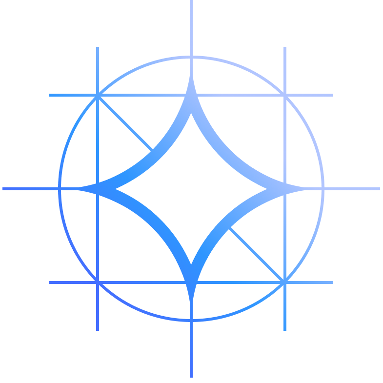

# TactileSight

**A wearable that tells a blind person what is around them, and how far away it is, in their own language.**

Built for the Qualcomm Snapdragon Multiverse Hackathon (Noida, 18–19 July 2026).

## Built with

<p>
  
  &nbsp;&nbsp;
  
  &nbsp;&nbsp;
  
  &nbsp;&nbsp;
  
  &nbsp;&nbsp;
  
</p>

- **Qualcomm / Snapdragon** — the app runs on a Snapdragon 8 Elite Gen 5 (SM8850). The shipped inference path is **QAIRT on the Hexagon NPU** via GenieX, using a bundle Qualcomm compiled for this exact chipset and published on AI Hub.
- **Sarvam AI** (hackathon sponsor) — all speech in and out: ASR, speech-to-text-translate, translation, and `bulbul:v3` TTS across 11 Indian languages.
- **Qwen** — **Qwen3-VL-4B-Instruct (w4a16)** is the on-device vision-language model, and the only one shipped in `models/`.
- **Gemma** — **Gemma 4 E4B** is the private-server option (llama.cpp + CUDA, `server/run-gemma.sh`), and the model the on-device engine comparison below was measured against.

Trademarks belong to their respective owners and are shown here to identify the stack. Sarvam AI is a hackathon sponsor; nothing else here implies endorsement or partnership.

---

## The problem

A white cane reaches about a metre and tells you only that *something* is there. It cannot tell you the doorway is on your left, that the thing ahead is a person rather than a pillar, or what the sign above the counter says.

Existing AI assistants describe a photo, but they **guess at distance** from a flat image. A confident wrong distance is worse than no distance at all when you are walking.

## What it is

Two layers, split by what each is good at:

| Layer | Answers | How | When |
|---|---|---|---|
| **Haptic band** | **Where**: obstacle geometry | depth camera → vibration, on the band itself | continuous, works with the phone off |
| **Phone app** | **What**: identity, text, context, measured distance | one capture → detector + depth + vision-language model → speech | on demand, one press |

The band handles reflexes. The phone handles understanding. Nothing streams: a press captures one colour frame and one depth frame from the same instant, and the camera is idle between presses (ADR-0009).

This repository is **the phone app**. The band's own firmware and haptic loop live in the companion repo, [VidhuSarwal/tactile-sight](https://github.com/VidhuSarwal/tactile-sight) — the Orbbec depth camera and the haptic band on an Arduino UNO Q. The two tracks meet at one place only: the `FrameSource` seam, which hands this app a colour frame and a depth frame captured at the same instant. Everything below is the phone side.

### What is in this repo

```
android/    the Android app (Kotlin) — capture, detection, depth, VLM, speech
server/     optional private-server tier (FastAPI) for the off-device path
models/     the shipped Qwen3-VL-4B QAIRT bundle and the YOLOv11 detector
docs/adr/   decision records — the reasoning behind everything here
```

---

## The interaction

**One button. Tap to describe, hold to ask.**

- **Tap** (under 400 ms) → a description of what is ahead, with a measured distance in front of it.
- **Hold** → the frame is captured at press-down, the mic records while you hold, and the question is asked on release. Say nothing and you get a description anyway — a hold that produced no usable transcript falls back to describing rather than apologising.

The mic opens on *every* press-down and the buffer is discarded on a tap. Waiting for the 400 ms threshold to start recording would be tidier and would eat the first word of every question.

The frame is taken at press-down in both cases: by the time a question ends, the user may have turned their head.

**Every press yields speech.** Capture failure, model failure and a blank answer all degrade to a spoken sentence. A dead press — silence with no explanation — is the one outcome a blind user cannot recover from.

### Launching it: tap the phone to the band

Everything else here is reachable without sight. *Finding the app icon* was the exception, so the band carries an NFC tag. Tapping the phone to it opens the app and speaks "TactileSight is ready" in the user's language — touching the band and hearing nothing is indistinguishable from it not working.

The tag uses a **custom MIME type we own**, not an Android Application Record: an AAR sends a user without the app installed to the Play Store, which is useless for a sideloaded build and worse than useless for a blind user. The app writes its own tags, so provisioning a band needs no second app and no laptop (behind a dev flag — see below).

### First run: spoken language setup

A spoken setup that asks "which language?" has to ask in *some* language. So it asks twice:

```
"Choose language."      (English)
"भाषा चुनें।"            (Hindi)
```

Whoever is holding the device understands one of them. Two prompts rather than eleven, which would be forty seconds before the device did anything.

The answer resolves two independent ways, because either alone fails someone:

1. **They name it** — "Hindi", "हिंदी", "Punjabi", "Tamil". Aliases cover the endonyms and the romanisations Sarvam actually returns: *bangla*/*bangali* for Bengali, *oriya* for Odia, *panjabi*, *tamizh*, *angrezi*, plus each language's own script. ("Bangali" being refused while "Bengali" worked was a real reported bug — the one spelling accepted was the one a native speaker is least likely to say.)
2. **They just speak** — anything at all, in any language, and Sarvam reports the language code. Verified on device: random Hindi room chatter resolved to `hi-IN` with no language name in the transcript at all.

A named language beats a detected one when they disagree: saying "Punjabi" *in English* means Punjabi.

The confirmation — "Language chosen." — is then spoken **in the language just chosen**, from strings authored ahead of time rather than translated at runtime. Translating it would spend another round trip at the exact moment the user is waiting to find out whether they were understood. ⚠️ The Telugu string is intelligible but wrong in form (`ఎంచుకున్న భాష.` is the noun phrase "chosen language") and wants a native speaker.

Setup marks itself done even when it understood nothing, and English stays. Asking again on every launch is worse.

**11 speakable languages:** English, हिन्दी, ਪੰਜਾਬੀ, বাংলা, ગુજરાતી, ಕನ್ನಡ, മലയാളം, मराठी, ଓଡ଼ିଆ, தமிழ், తెలుగు. That list is Sarvam's `bulbul:v3` ceiling, not ours: `sarvam-translate:v1` translates 22, but offering a language we can translate and cannot speak means the user hears an error instead of their answer, so the picker lists only what is speakable.

---

## The distance pipeline

This is the part worth reading.

**The vision model is forbidden from stating a distance.** It cannot measure, so it must not guess. That rule is in the prompt, and it is what makes the other half affordable: **every number the user hears came from the depth sensor.**

The distance comes from the band's **Orbbec Astra Pro Plus** — colour, depth and infrared, registered, captured together.

### Per-direction: the nearest surface in each third

`RegionDistance` splits the depth frame into left / ahead / right and takes the **10th percentile of valid pixels** in each.

- **Never the raw minimum.** One speckle or edge pixel reading 400 mm turns "a clear corridor" into "something at arm's length", confidently.
- **A ceiling cut at 0.25 of frame height, and a floor cut at 0.80.** Both were real bugs that read as plausible. Without the ceiling cut, an empty alcove was spoken as "about three metres ahead" while the wall is 5.3 m away — the top of the frame is *ceiling*, two metres above your head, and a low percentile finds it first. Every corridor would have understated the distance to whatever was actually in front of you and nothing would have sounded wrong. 0.25 was chosen by measurement: it corrects that capture from 3.2 m to 5.1 m and leaves every other capture unchanged.
- **Readings outside 400–8000 mm are noise, not surfaces.**

### Per-object: YOLOv11 on colour, projected into depth

`ObjectDetector` runs **YOLOv11** (TFLite, 640×640, COCO's 80 classes) over the colour frame, with non-maximum suppression because the exported graph decodes boxes but does not suppress them — one person arrived as six overlapping boxes. Confidence floor 0.35, chosen so that the empty alcove capture still yields **zero** detections: a device that invents a person in an empty corridor is worse than one that stays quiet.

`ObjectDistance` then projects each box into the depth frame and applies the same percentile.

**Detection runs on colour, not infrared, and that is a reversal.** ADR-0013 specified detection on IR, because IR shares depth's exact 640×480 grid and a box would index depth 1:1 with no calibration at all. The reasoning was sound; the data was not. Measured across all 20 shipped captures, **mean IR brightness is 3.2/255 and 0.36% of pixels exceed 40 — four captures have none at all.** A detector trained on daylight photographs finds nothing in a black frame. IR was removed from `Frame` entirely. If the band's IR exposure is ever fixed, the 1:1 path is strictly better and worth restoring.

So the box is mapped instead through an **empirically measured correspondence**, not a calibration — `calib.json`'s 720p colour intrinsics are wrong by 13–18%:

```
RGB x 0.09 .. 0.88    <->  depth full width       (colour sees wider)
depth y 0.07 .. 0.955 <->  RGB full height        (depth sees taller)
```

It is a linear fit between two rectangles, so it is good **to about a box, not to a pixel**, and it degrades with parallax up close. That is enough to land a person's box on a person's depth. Validated on the captures: one scene's person reads 1.1 m from their box and 1.1 m from the whole left third, independently.

A box can project entirely outside depth's field — colour sees wider than depth measures — and those come back unknown, which is honest.

### Telling a poster from a person

A life-size printed advertisement of two people defeats every other check: it is detected correctly, sits at a real measured distance, and is the right apparent size. The device announced it as *"a person one and a half metres in front of you."* The distance was true; the noun was not.

What gives it away is that **a poster is a plane and a body is not**. `ObjectDistance` fits `z = ax + by + c` by least squares over the depth inside each box and measures the residual as a fraction of the distance. The plane fit rather than the raw spread, because a wall viewed at an angle has a large depth *range* while being perfectly flat.

```
poster (id014)      33 mm, 9 mm   ->  2.6%, 0.9% of distance
real person 1.1 m   556 mm        ->  52%
real person 1.0 m   966 mm        ->  94%
real people 2.3 m   152 mm        ->  6–7%
flat wall (id011)   ~58 mm        ->  sensor noise
```

The threshold is 5%, set from that gap rather than chosen, erring toward silence. Losing the word "person" costs a little information; inventing one costs the user's trust.

Suppression only removes the **name** — the distance is still real, so the answer falls back to "one and a half metres ahead", which is true of a poster, a wall and a door alike. And when *every* person in frame reads flat (not *any* — a hall with a banner behind real people must not be hijacked by the banner), the phone tells the VLM so, and the description prompt is **replaced** with one that says a poster or screen is ahead.

### Saying "I don't know"

Depth fails on glass, dark and reflective surfaces. Across the real captures, **valid depth coverage averages 62.6%, ranging 36%–98%**, and one measured region came back **6% valid** while regions with a real surface ran 15–95%. Below 10% valid, the region or object returns **no distance at all** — not "distance unknown to your left", just silence about that direction, while the description still names whatever was seen there.

"Distance unknown" is a common path, not an edge case.

### Naming what the distance belongs to

*"about four metres ahead"* tells a user something is there. *"people four metres ahead"* tells them what to do about it. The noun can only come from the VLM: **COCO has no class for a wall, a doorway, a stair or a corridor**, which is most of what a building is made of.

So the halves come from different places on purpose — what it is from the VLM, how far from depth. The naming is a **second, separate VLM call** with one job, asking for `AHEAD=<thing>; LEFT=<thing>; RIGHT=<thing>`. Asking for it *inside* the description prompt was tried and destroyed the description: on a room full of people the model answered "in front of you, to your left, and to your right, there is nothing", and on the next scene emitted the raw structured line as its spoken sentence. A 4B model given two jobs does neither.

The second call costs **~330 ms** against a press that spends seconds in speech, and it runs after the description exists so it cannot spoil it. Parsing is deliberately the weakest possible ask — three keys, short values, `NONE` allowed — and any malformed answer falls back to the unnamed clause.

### What is actually spoken

Distance first, then the description. Three numbers on every press is noise, so: **ahead is always spoken when known**; a **side only when it is close and nearer than ahead**; nothing at all about a direction with no reading. Rounding is coarse on purpose — half-metres up close, whole metres further out. The method is good to roughly a half-metre, and "1.43 metres" would claim a precision it does not have. To someone who cannot check it, a confident decimal is a lie told fluently.

---

## Phone-camera mode

The app also runs with **no band at all**, on the phone's own back camera (CameraX, on-demand `ImageCapture`, no preview bound — the user it is built for cannot see one).

**It speaks no distances. Ever.** A phone has no depth sensor, so the source returns an empty depth map and `Frame.hasDepth` gates the entire measured path. The alternative — letting the model estimate — would put a guessed metre in front of someone who cannot see the thing they are about to walk into, which is the precise failure the depth work exists to prevent. The mode announces the difference aloud when selected.

Object detection still runs, because YOLO reads colour. Things are still named, just unmeasured — reusing the path that already existed for glass and out-of-range objects rather than adding a branch.

| | band | phone camera |
|---|---|---|
| answers | what **and** how far | what |
| distance | measured, from depth | none, ever |
| needs | the band | nothing |

Frames are captured into memory and dropped, never written to storage: a blind user's surroundings should not accumulate on disk as a side effect of asking what is in front of them.

---

## The engines

Two destinations, chosen by a switch labelled with **where the frame goes** rather than with an engine name:

| | | |
|---|---|---|
| **🔒 On phone** | Qwen3-VL-4B on GenieX/QAIRT, Hexagon NPU | the frame does not leave it |
| **☁️ Private server** | our own laptop, over the LAN | the frame leaves this phone |

The private server accepts two wires and the app's Check button probes which: `server/app.py`'s `POST /v1/describe`, or an OpenAI-compatible `POST /v1/chat/completions` (LM Studio, llama.cpp, vLLM) directly — the simpler setup, and the one that matters when the server is not ours to change.

**The on-device model stays resident when you switch to the server.** It used to be closed: four gigabytes of mapped weights evicted to make room for an HTTP client, and a multi-second reload waiting on the way back. The one-model-resident rule it was obeying is about never holding two *models*; a server brain is an HTTP client, not one of those. So the local brain is now parked, not released, and coming back to it is instant. It is released only on a genuine engine or model change.

Related, and also a hard rule: **the brain belongs to the `Application`, not to an Activity.** The previous app released its model in `onDestroy`, so every rotation dropped and reloaded gigabytes, leaked the native allocation, drove available RAM to ~1 GB and was **OOM-killed six times**.

The model is warmed at startup and the status line reports `LOADING` / `READY` / `FAILED` from the *model*, not from the picker. It previously read `Ready · GenieX (qairt/npu)` the moment an engine was chosen, while nothing had been mapped — so the first press after launch came back "Sorry, I could not see that" under a screen that said Ready.

### The prompt

Terse, guide-voiced, and every clause was paid for in debugging (`brain/VlmPrompt.kt` documents each one, and `server/prompt.py` mirrors it for the server tier). The load-bearing parts:

- *"any objects or animals on the floor"* — without it the model fixates on large background objects and skips the small subject in the foreground. A cat sitting in the path is exactly what a walking user needs to hear about.
- *"never guess their gender"* — the model reached for "a man sitting on it" on every figure it saw. It is inferring gender from clothing and build, our user cannot see the mistake, and the whole device rests on trusting what it says.
- *"if there are none, say nothing about people at all"* — instructing it to report people made it announce their absence, and "there is no one in front of you" on every empty corridor trains the user to stop listening.
- *"read the words out"* on signs — a description that names a door but not the WASHROOM written on it is scenery, not navigation.
- *"Do not mention colours"* — added after a lounge came back as "a red bean bag chair, a green bean bag chair, a blue bean bag chair, a yellow bean bag chair".
- *"Never state a distance."*

Two rules learned the hard way, recorded so nobody undoes them: **never put an example phrase in the prompt** (a version containing *"like 'a few chairs to your left'"* echoed it verbatim into scenes with no chairs, and started fabricating signs reading "EXIT" and "Welcome to the Plaza"), and **every "always report X" needs its "say nothing when there is no X"**.

### Speech

The VLM answers in **English** — small VLMs are markedly weak in Indic languages — and Sarvam does the rest (ADR-0012):

```
speech (any language) --/speech-to-text-translate--> English question
                                                          |
                                                     VLM (English)
                                                          |
                   user's language <--/translate-- English answer --> TTS
```

The query path is deliberately **not** a mirror of the describe path. `/speech-to-text-translate` lands in one round trip where transcribe-then-translate takes two, and it **auto-detects the spoken language**, so the language picker stays a speech-*out* preference rather than something the user must set correctly before they can be understood at all.

⚠️ **TTS synthesises; it does not translate.** Sending English text with `target_language_code: pa-IN` returns English words in a Punjabi voice — the call succeeds, audio plays, nothing in the logs looks wrong, and the user understands nothing. The translate step is not optional and its absence is invisible.

---

## Dev vs user mode

A switch, always visible, persisted, defaulting to dev. A mode you cannot leave without clearing app data is a trap.

- **User mode** is the app: one button, the destination switch, a 🌐 that re-runs the spoken language setup. (A symbol rather than a language name, because the name would have to be written in *some* language and this control exists for someone who cannot read the one currently set.)
- **Dev mode** adds the machinery: frame-source picker, server address, model name, prompt override, the bundled-capture browser, and the colour/depth previews.

The engine and camera pickers live in dev only. User mode does not choose a camera; it uses the live source, and until the band link exists (#19) it says so in the log rather than dressing bundled captures up as a live band.

**Token streaming.** The model already decoded token by token; the intermediate text was being collected into a `StringBuilder` and thrown away. It now appears on screen at decode speed. A press spends seconds in the model and seconds more in translation and speech, and a screen reading "Looking…" for twenty of them is indistinguishable from one that has hung. It is also the clearest evidence the answer is being generated on the phone, with no network in the way.

Only the description streams — spraying `AHEAD=people; LEFT=furniture` across the status line would show the machinery instead of the answer. And it is **sighted-only by design**: the spoken answer still arrives whole, at the end. Speaking half-formed clauses as they decode would be worse than silence for the user this is built for.

---

## Measured performance

Every number here is from the OnePlus 15 (Snapdragon 8 Elite Gen 5 / SM8850), same capture, same prompt, taken with the runtime's own profiler. Nothing is estimated.

| runtime / compute unit | model | model load (once) | time to first token | prefill | decode |
|---|---|---|---|---|---|
| **GenieX QAIRT / NPU** ← shipped | Qwen3-VL-4B w4a16 | **6.7–7.2 s** | **260 ms** | **1287 tok/s** | 24–28 tok/s |
| GenieX llama.cpp / NPU (Hexagon) | Gemma-4-E4B q4_0 QAT | 29.2 s | 2688 ms | 142 tok/s | 13.5 tok/s |
| GenieX llama.cpp / GPU (Adreno) | Gemma-4-E4B q4_0 QAT | 27–32 s | 3417 ms | 93 tok/s | 11.5–16.7 tok/s |
| GenieX llama.cpp / HYBRID | Gemma-4-E4B q4_0 QAT | 31.2 s | 4087 ms | 94 tok/s | 13.3 tok/s |

**QAIRT on the NPU is an order of magnitude ahead** — 13× faster to first token than the GPU, 9× the prefill throughput, and it loads in a quarter of the time. It also answered *better*: the GPU run placed a centre sign on the right and padded with "a central area".

Two findings worth stating plainly, because both were open questions:

- **llama.cpp genuinely does reach Hexagon.** A community GGUF runs on the NPU with no QAIRT bundle, ~27% better first-token latency than the GPU. It matters because QAIRT only loads architectures it has a compiled factory for, so this is the route for everything else.
- **HYBRID is the slowest option.** It matches the GPU on throughput and adds ~20% latency: split-execution overhead with no benefit here.

Other measured figures used above: **~330 ms** for the direction-naming second pass; **62.6%** average valid depth coverage (36–98%); **3.2/255** mean IR brightness across the 20 shipped captures; depth verified metric from **0.45 m to 9.94 m**.

---

## Build and run

One Gradle module, `:app` — `com.tactilesight`, `minSdk 29`, `compileSdk`/`targetSdk 34`.

```bash
cd android
JAVA_HOME=/path/to/android-studio/jbr ./gradlew assembleDebug
adb install -r app/build/outputs/apk/debug/app-debug.apk
```

`INSTALL_FAILED_UPDATE_INCOMPATIBLE` means the build is signed differently — uninstall first. That wipes app data, but models live in the external files dir and survive.

**JDK 17–21.** System JDK 25 will not work — Gradle 8.x's Kotlin compiler throws `IllegalArgumentException: 25.0.3` parsing the version. `org.gradle.java.home` does **not** belong in `local.properties`; Gradle never reads that file. Put it in `~/.gradle/gradle.properties`, or use Android Studio's Gradle JDK setting.

### Credentials

Create `android/local.properties` (gitignored):

```properties
sdk.dir=/path/to/Android/Sdk
sarvam.api.key=<your key>
```

The key is compiled in as a `buildConfigField`, which means **a restored or rotated key needs a rebuild** — the running APK carries the old one. (That cost ten minutes of looking in the wrong place when Sarvam ran out of credits mid-session and every press failed with HTTP 402.)

⚠️ This arrangement is deliberate for a hackathon build only. **The key is extractable by anyone holding the APK and must be rotated after the event.** Do not ship it to real users.

### Staging the model

The QAIRT bundle is 1–6 GB. It is **not** in the APK and **must not** be downloaded at the venue — the hall network measured 0.3–15 MB/s with repeated drops, and a multi-GB pull was killed repeatedly.

```bash
adb push <bundle>/. /sdcard/Android/data/com.tactilesight/files/models/geniex/
```

⚠️ **Note the trailing `/.` — push the bundle's *contents*, not the folder.** `adb push <dir> <target>` creates the new subdirectory as `shell:ext_data_rw` mode 770, which the app's uid cannot traverse, so the model becomes invisible to the app that needs it. The engine directory is created *by the app*, so it stays app-owned. The symptom does not name the real cause:

```
[plugins/qairt/src/vlm.cpp:88] No .bin LLM shards found in: …/files/models/geniex
```

One directory holds one bundle, which is why each backend gets its own (`geniex/` for QAIRT `.bin` shards, `geniex-gguf/` for GGUF + `mmproj`). The app scans the directory at startup, so adding a model is pushing a folder — no rebuild. Models live in *external* files so an uninstall/reinstall does not wipe them. See `brain/ModelStore.kt`.

With no model staged the app still runs and still speaks; it falls back to a stub sentence rather than a dead press.

### Dev hooks

Not on screen, because a button that arms NFC dispatch is one mis-tap from firing in front of a judge:

```bash
adb shell am start -n com.tactilesight/.MainActivity --ez writetag true
```

### The private server (optional)

Only needed for the ☁️ destination. The on-device path needs none of this.

```bash
cd server
python -m venv .venv && source .venv/bin/activate
pip install -r requirements.txt

# wire test, no model, no GPU
TS_VLM_BACKEND=mock uvicorn app:app --host 0.0.0.0 --port 8000

# real descriptions: Gemma 4 E4B on llama.cpp/CUDA, then point our server at it
./run-gemma.sh
TS_VLM_BACKEND=openai TS_OPENAI_BASE_URL=http://localhost:8080/v1 \
  uvicorn app:app --host 0.0.0.0 --port 8000
```

The app's Check button probes which wire the address speaks — our `POST /v1/describe`, or an OpenAI-compatible `POST /v1/chat/completions` — so pointing it straight at LM Studio or llama-server works with no FastAPI layer at all.

### Tests

```bash
cd android && ./gradlew testDebugUnitTest      # 67 JVM unit tests
cd server  && TS_VLM_BACKEND=mock python -m pytest   # 9 tests, green
```

The app suite is pure logic behind the seams — the distance percentile and its validity threshold, plane-fit poster rejection, gesture/mode routing, language resolution, the `.npy` reader — including `RealCaptureDistanceTest`, which runs against the bundled Astra captures rather than synthetic data. Camera, TTS, ASR and the inference runtimes are deliberately not unit-tested; they are the hardware boundary and are checked on device against [`TEST_GUIDE.md`](TEST_GUIDE.md)'s checklists.

`server/test_app.py` is the only automated guard on the frozen phone↔server HTTP contract. Run it before changing anything in `server/`.

---

## Status

An honest snapshot.

**Working, on device:**

- On-device VLM on the Hexagon NPU, 260 ms to first token
- Per-object measured distance: YOLOv11 → depth projection → 10th percentile, with plane-fit poster rejection
- Per-direction distance with the ceiling/floor horizons
- One-button tap/hold, hold-to-ask through Sarvam ASR
- NFC tap-to-launch, written and read on a real tag
- Spoken language setup in 11 languages, confirmation spoken in the chosen language
- Phone-camera standalone mode, speaking no distances
- Private-server tier against both `server/app.py` and LM Studio directly
- Token streaming to the screen; dev/user mode
- **Sign reading** — the model reads text off doors and signage (*"a sign that says ELEVATOR"*), which is what makes a corridor navigable rather than merely described
- 20 real Astra captures bundled in the APK, verified metric (0.45–9.94 m)

**Known limitations, stated plainly:**

- **Absolute distance has never been checked against a tape measure.** Every number here is internally consistent and cross-validated between two independent methods, which is not the same as correct. Tape-measured ground truth for a few scenes is still an open ask of the band team.
- **The live band link (#19) is not built.** There is no WebRTC source. The band path runs on bundled captures; the `FrameSource` seam is where a live producer drops in.
- **No offline TTS fallback.** If Sarvam is unreachable the app is *silent, not degraded* — including the distance clause. This is an accepted MVP risk with a known mitigation (Android TTS behind the `SpeechIO` seam) that was deliberately deferred. The venue network already proved unreliable.
- **ASR accuracy at the venue is unmeasured.** The round-trip verification used our own synthesised speech: no room noise, no mic distance, no crosstalk. It proves the wiring and the model names are right, nothing more.
- **Telugu confirmation string** is intelligible but grammatically the wrong form.
- **IR is unusable as shipped** — geometrically perfect, practically black. The IR-brightness confidence signal ADR-0013 proposed does not reproduce on our own captures and nothing is built on it.
- **A dark-scene and a glass/reflective-scene capture** have not been taken. Glass is the worst case for depth holes and we have not measured it.

---

## Design documentation

Every significant decision is written down with the alternatives and the reason:

- [`CONTEXT.md`](CONTEXT.md) — domain glossary and settled design
- [`docs/adr/`](docs/adr/) — decision records. The current ones are [0009](docs/adr/0009-multi-sensor-band-pipeline.md) (band pipeline), [0010](docs/adr/0010-three-engine-on-device-inference.md) (on-device inference), [0011](docs/adr/0011-interaction-model-and-modes.md) (interaction), [0012](docs/adr/0012-speech-and-language-via-sarvam.md) (speech), [0013](docs/adr/0013-ir-aligned-calibration-free-distance.md) (distance), [0014](docs/adr/0014-qairt-only-and-the-qwen-family.md) (QAIRT and the Qwen family). Several carry same-day amendments where measurement contradicted the decision — those are the interesting parts.
- [`TEAM.md`](TEAM.md) — build, traps, and everything that cost someone an hour

The KDoc in `android/app/src/main/java/com/tactilesight/` is not decoration: `core/Orchestrator.kt`, `frame/ObjectDistance.kt`, `frame/RegionDistance.kt` and `brain/VlmPrompt.kt` each record what failed before the current code, with the measurements.

---

## Who this is for

Roughly 2.2 billion people live with vision impairment; around 43 million are blind, and most live in low- and middle-income countries where a flagship phone is not a given and English is not the first language. That is why the design insists on three things a demo could easily skip: **it must work on cheaper phones**, **it must speak Indian languages properly**, and **it must never state a distance it did not measure**.
